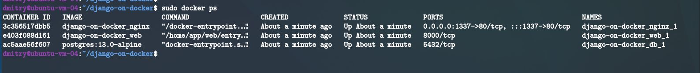
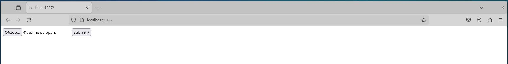
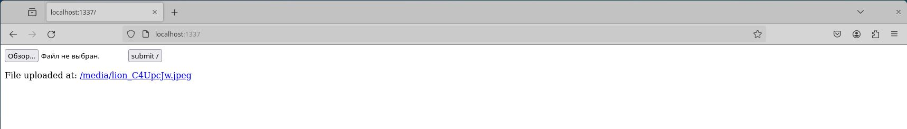
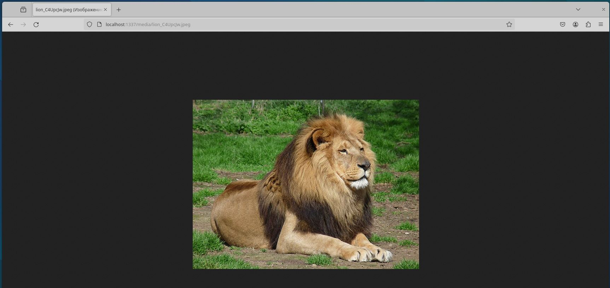
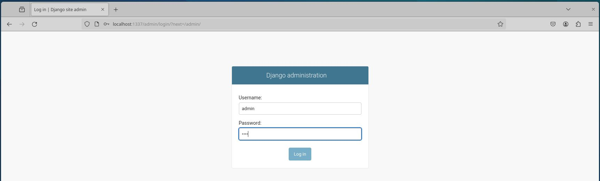
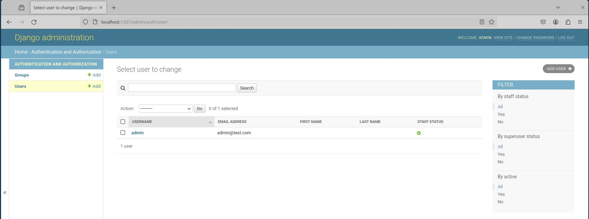

# Докеризация Django с помощью Postgres, Gunicorn и Nginx.
В данном проекте произведена настройка  **Django** для запуска в **Docker** с поддержкой **Postgres**. Для производственных сред добавлены **Nginx** и **Gunicorn**. Также подключены статические и медиафайлы **Django** через **Nginx**.

Зависимости:
- Django v3.2.6
- Docker v20.10.8
- Python v3.9.6  

Для того чтобы запустит все необходимые сервисы, нужно выполнить команду:

*  $ docker-compose -f docker-compose.prod.yml up -d --build

---
## Для проверки работоспособности, необходимо:

    Загрузите изображение на http://localhost:1337/.
    Затем просмотрите изображение на http://localhost:1337/media/IMAGE_FILE_NAME.

***Если проект размещен на удаленном хостинге, то вместо "localhost" нужно ввести IP-адрес сервера ('192.168.#.#), либо доменное имя.***

---
##  Подтверждение работоспособности проекта. 
Контейнеры из файла docker-compose.prod.yml собрались и запустились. 

 

Переходим по ссылке http://localhost:1337, появляется страница с формой загрузки изображения на сайт.

 

Подгружаем файл-изображение.

 

Для его просмотра переходим по ссылке:
http://localhost:1337/media/IMAGE_FILE_NAME.

 

Так же у нас есть возможность входа в панель администратора Django.

 

Окружение самой панели.

 

